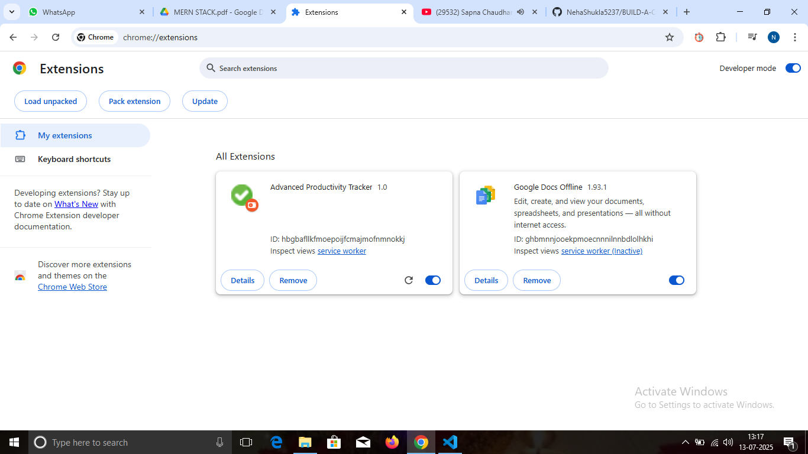
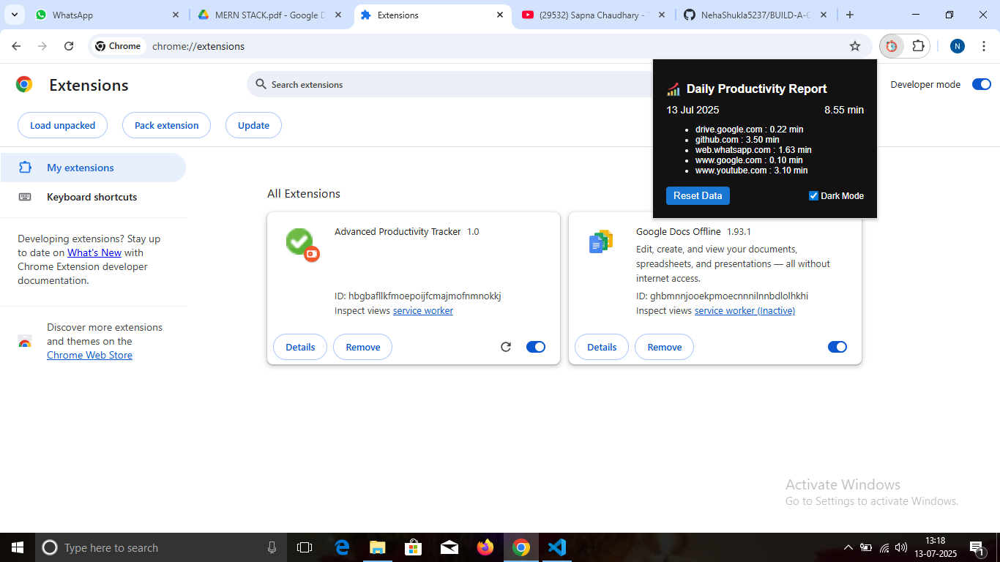

# 🚀 Productivity Tracker Chrome Extension + Backend (MERN)

A modern and responsive Chrome Extension for productivity tracking. It tracks time spent on websites, sends productivity alerts, and shows daily reports. Includes a backend (Node.js + Express + MongoDB) for syncing data across devices.

---

**Company:** CODTECH IT SOLUTIONS
**Name:** Neha Shukla
**Intern ID:** CT06DF671
**Domain:** MERN Stack Web Development
**Duration:** 6 Weeks
**Mentor:** Neela Santosh Kumar

---

## 📌 Project Instructions

> **BUILD A CHROME EXTENSION FOR PRODUCTIVITY MANAGEMENT**
> DEVELOP A CHROME EXTENSION THAT ACTS AS A PRODUCTIVITY TRACKER. THE EXTENSION WILL:
>
> ✅ MONITOR TIME SPENT ON DIFFERENT WEBSITES
> ✅ BLOCK DISTRACTING SITES *(optional, can be removed)*
> ✅ PROVIDE DAILY PRODUCTIVITY REPORTS
> ✅ USE MERN STACK FOR BACKEND FUNCTIONALITIES LIKE STORING USER PREFERENCES, GENERATING REPORTS, AND SYNCING DATA ACROSS DEVICES.

---

## 🧩 Features

| Feature          | Description                                              |
| ---------------- | -------------------------------------------------------- |
| ⏱️ Time Tracking | Track how much time you spend on each website            |
| 🚫 Site Blocking | Block or redirect distracting sites *(optional)*         |
| 📅 Daily Report  | View total time spent and date in clean format           |
| 🔔 Notifications | Alerts when too much time is spent on unproductive sites |
| 🌙 Dark Mode     | Toggle between Dark and Light mode                       |
| 📊 Backend Sync  | Sync time data with MongoDB backend                      |

---

## 📁 Folder Structure

```
productivity-tracker-extension/
├── extension/                  # Chrome Extension Frontend
│   ├── manifest.json
│   ├── background.js
│   ├── popup.html
│   ├── popup.js
│   ├── style.css
│   ├── icons/
│   │   ├── icon16.png
│   │   ├── icon48.png
│   │   └── icon128.png
│
├── backend/                   # Node.js + MongoDB Backend
│   ├── server.js
│   ├── package.json
│   ├── routes/
│   │   └── trackRoutes.js
│   ├── models/
│   │   └── TrackingData.js
│   └── config/
│       └── db.js
│
├── popup1.png                # Screenshot 1 (root folder)
├── report1.png               # Screenshot 2 (root folder)
└── README.md
```

---

## 🚀 How to Use

### 🔹 Start Backend (Optional for Sync)

```bash
cd backend
npm install
npm start
```

### 🔹 Load Chrome Extension

1. Open Chrome → `chrome://extensions`
2. Enable **Developer Mode**
3. Click **"Load Unpacked"**
4. Select the `extension/` folder

---

## 📸 Screenshots

### 🔹 Extension Popup – Start Tracking Interface



### 🔹 Daily Report – With Date, Time, and Toggle



---

## 🛠 Tech Stack

* **Frontend:** JavaScript, HTML, CSS, Chrome APIs
* **Backend:** Node.js, Express, MongoDB
* **Extension APIs:** `storage`, `tabs`, `alarms`, `notifications`

---

## 👩‍💻 Author

* **Name:** Neha Shukla
* **Project:** Advanced Productivity Tracker Chrome Extension
* **GitHub:** [@NehaShukla5237](https://github.com/NehaShukla5237)

---

---

## ✨ License

This project is open-source and free to use under the [MIT License](LICENSE).

